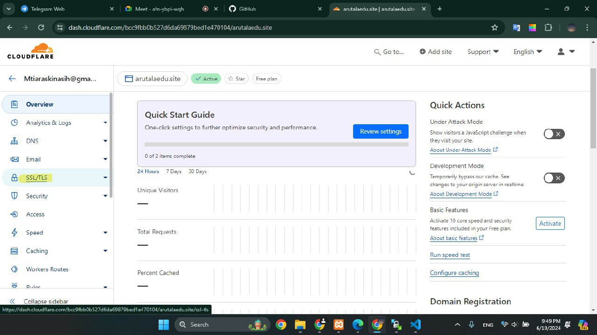
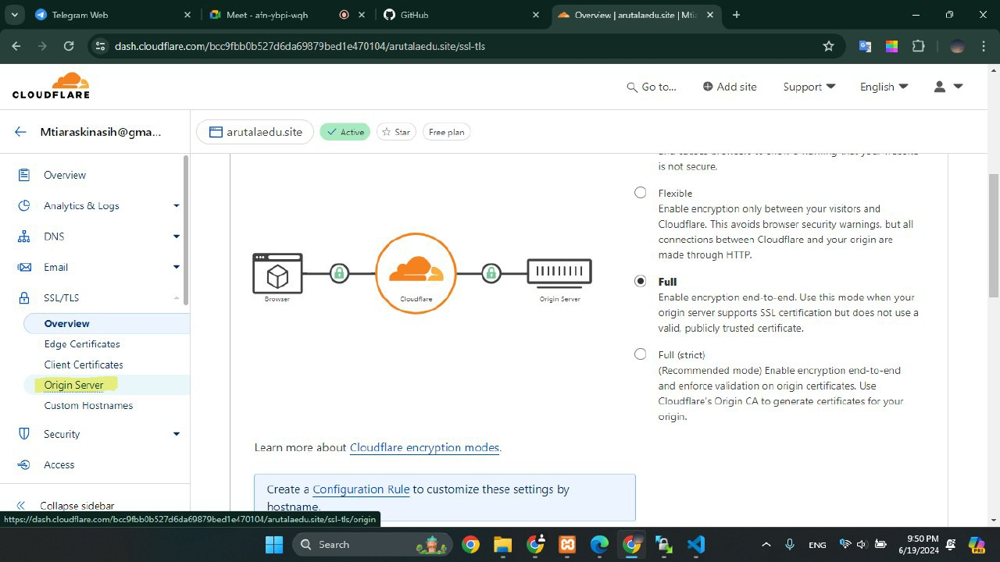
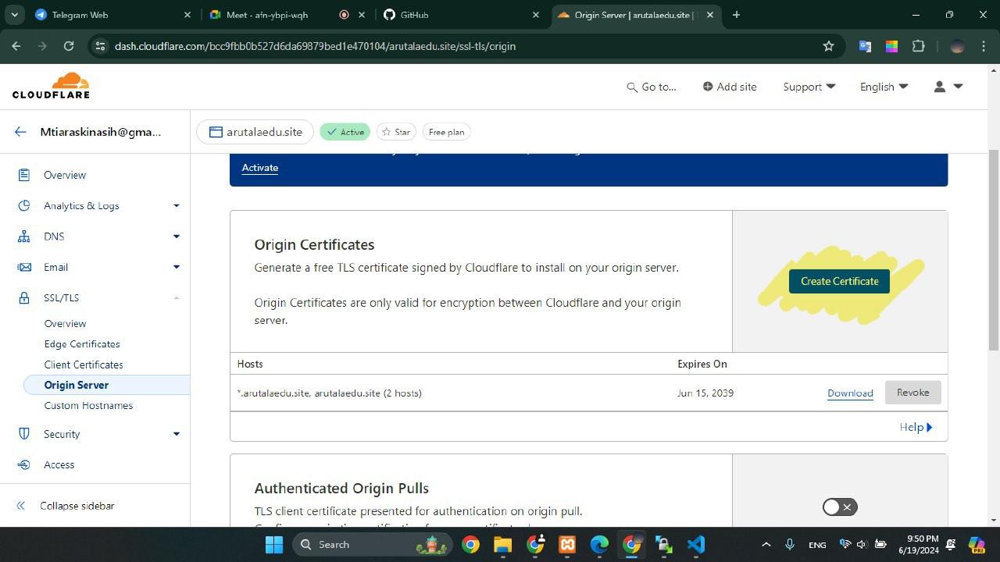
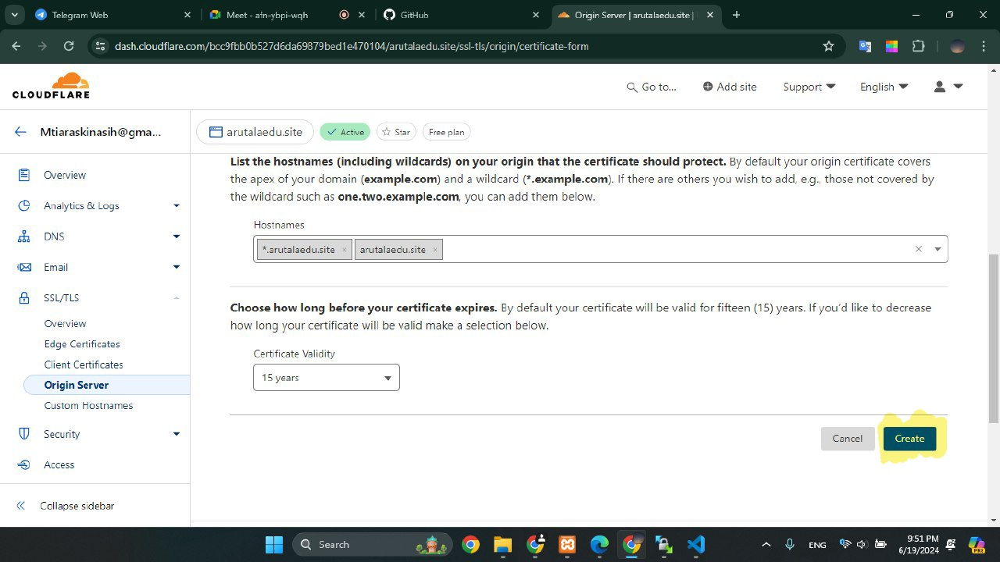
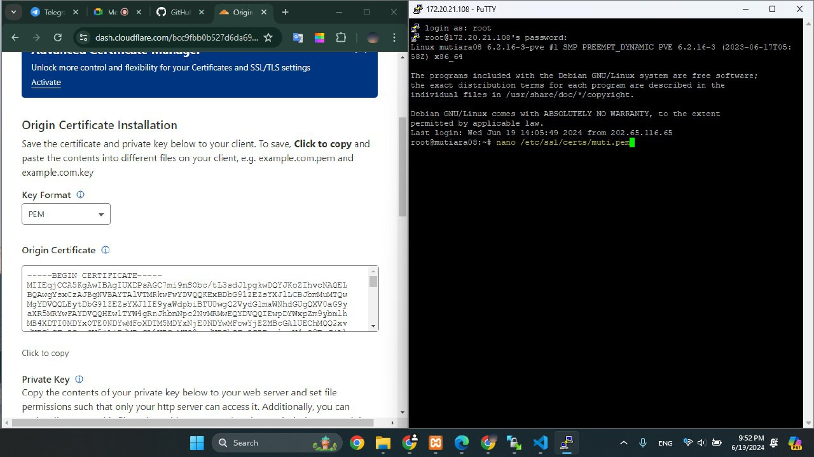
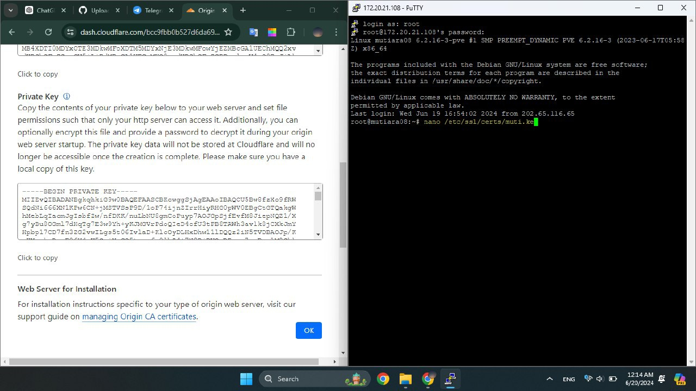
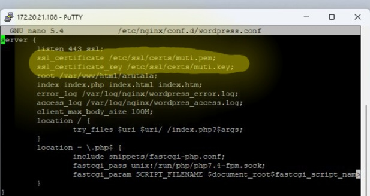
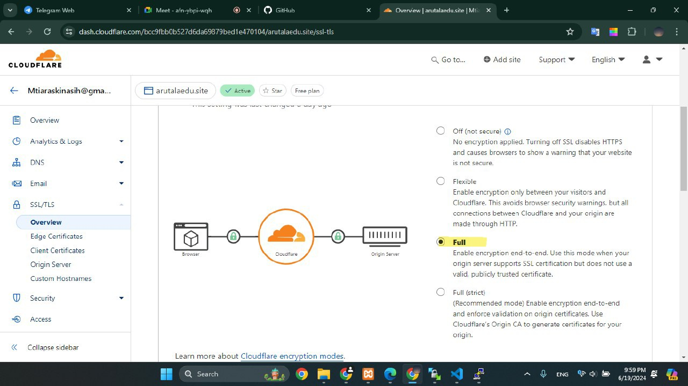

Menambahkan SSL/TLS di Cloudflare 
 
"SSL/TLS digunakan pada web publik untuk melindungi data yang dikirimkan antara pengguna dan server melalui enkripsi, memastikan bahwa informasi sensitif tidak dapat disadap oleh pihak ketiga. Selain itu, SSL/TLS menjamin integritas data sehingga tidak ada yang bisa mengubah informasi selama pengiriman. Protokol ini juga memungkinkan otentikasi server, memastikan bahwa pengguna berkomunikasi dengan server yang sah melalui sertifikat digital. Penggunaan SSL/TLS juga membantu membangun kepercayaan pengguna dengan menampilkan ikon gembok dan "https://" di URL, menunjukkan bahwa situs tersebut aman." 
 
Bagaimana caranya? berikut cara untuk menambahkan SSL/TLS di Website Publik melalui Cloudflare 
 
1. Pertama buka cloudflare-> masuk ke domain yang didaftarkan-> klik bagian SSL/TLS
   

2. Kemudian buka yang Origin Server
   
  
3. Setelah itu scroll ke bawah, cari bagian "Origin Certificates", dan Create Certificate
   
   
4. Kemudian atur sesuai kebutuhan atau langsung Create aja
   

5. Kemudian akan diberi Origin Certificate dan Private Key. Pada debian, buat file `[nama].pem` untuk origin certificate dan `[nama].key` untuk private key. Copy masing-masing ke dalam file yang sudah dibuat
    
   
7. Kemudian buka `nano /etc/nginx/conf.d/wordpress.conf`. Ganti bagian ssl_certificate dengan file yang sudah dibuat tadi
   
    
8. Jangan lupa bagian ini dibuat <b>Full</b>
   
